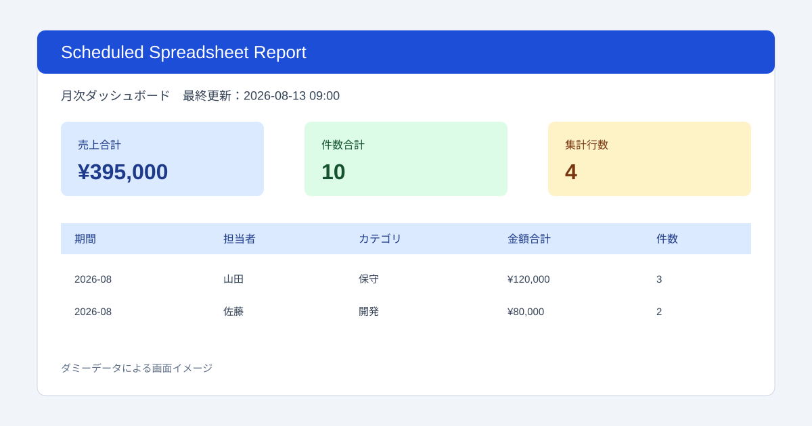

# PF005 | Scheduled Spreadsheet Report

明細データを日次・週次・月次で集計し、ダッシュボードを更新するGoogle Apps Scriptです。自主制作ポートフォリオであり、実在する顧客案件の成果物ではありません。



## できること

- 売上日、金額、件数、担当者、カテゴリを期間別に集計
- 日次・週次・月次から集計単位を選択
- 時間主導トリガーによる自動実行
- ダッシュボードを毎回作り直し、同一期間の重複行を防止
- Script Lockで同時実行を防止
- 実行日時、処理件数、出力件数、エラーをログへ保存
- ダミーデータをワンクリックで作成

## ファイル構成

- `Code.gs`：メニュー、シート入出力、実行ログ
- `AggregationCore.gs`：検証、期間キー、集計の純粋関数
- `TriggerService.gs`：対象ハンドラだけを安全に作成・削除
- `appsscript.json`：現在のスプレッドシート内だけを扱うManifest
- `tests/test_aggregation_core.js`：ローカル単体テスト

## 導入

1. Googleスプレッドシートを作成し、Apps Scriptへ3つの`.gs`を追加します。
2. `appsscript.json`を反映します。
3. `setupScheduledReport()`を1回実行します。
4. `設定`シートで集計単位とトリガー時刻を選びます。
5. `元データ`へ明細を入力するか、ダミーデータ作成メニューを使います。
6. 手動集計で結果を確認後、トリガーを設定します。

## 入力列

| 列 | 内容 | 例 |
| --- | --- | --- |
| A | 売上日 | 2026/08/01 |
| B | 金額 | 120000 |
| C | 件数 | 3 |
| D | 担当者 | 山田 |
| E | カテゴリ | 保守 |

## 安全性

- 許可スコープは現在のスプレッドシートとトリガー管理だけです。
- ダッシュボードは一括置換するため再実行しても重複しません。
- トリガー更新時は`runScheduledAggregation`用だけを削除し、他スクリプトのトリガーを触りません。
- 不正な日付、負数、空の担当者・カテゴリは処理前に拒否します。
- APIキー、メール、外部送信は使用しません。

## テスト

```powershell
node tests/test_aggregation_core.js
```

